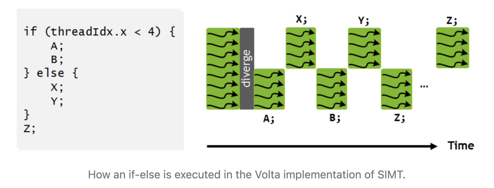

# GPU Kernels with CUDA C/C++

## Prerequisites
You have a host machine with
- CUDA-capable GPU(s),
- `nvcc` (Nvidia CUDA compiler), which is included in the Nvidia CUDA Toolkit.


## Usage
Compile with `nvcc` and execute:
```bash
nvcc -o src/saxpy.cu saxpy
./saxpy
```

## GPUs 101
### Design: GPU vs CPU
- GPUs were originally designed to render graphics, whereas CPUs are meant to control the logical flow of any general-purpose program. 
- Because of these different roles, GPUs have far more processing units and higher aggregate memory **bandwidth** (a measure of the data transfer speed between a GPU and its system), whereas CPUs have more sophisticated instructions processing and and faster **clock speed** (the number of times a second that a circuit operates). 


- The transistor counts associated with various functions are represented abstractly by the relative sizes of the different shaded areas. In the figure, green corresponds to computation; gold to instructions processing; purple to L1 cache; blue to higher-level cache, and orange to memory (which should be ~1000x larger than the caches).
- NOTE: the diagram does not depict the actual hardware design of any particular CPU or GPU. But, the figure does suggest that:
    - CPUs can handle more complex workflows than GPUs. 
    - CPUs don't have as many arithmetic logic units (LGUs) or floating point units (FPUs) as GPUs (roughly the small green boxes), but the ALUs and FPUs in a CPU core are individually more capable.
    - CPUs have more cache memory than GPUs.

- Crucially, GPUs are designed for workloads that can be **parallelized** to a significant extent. This is indicated in the diagram by the GPU having just one gold control box for every of the small green computational boxes. 

### Performance: GPU vs CPU
- The figure below show the peak speed (measured in billions of floating point operations per second, also known as **GFLOPS**). 

- Note that single precision floats can often be processed 2x faster than their double precision counterparts. 
    - **Single precision** refers to a 32-bit representation of floating point numbers (also called FP32).
    - **Double precision** refers to a 64-bit representation of floating point numbers (also called FP64). 

### Heterogeneous Applications and the CUDA Programming Model
- **GPGPUs** (general purpose computing on GPUs): the fact that any application requiring a huge number of floating point operations can gain significant speedup using GPUs. 
- NVIDIA CUDA is one of the key enabling technologies for GPGPU. It was one of the first APIs to accelerate numerically intensive computations such as matrix multiplications, fast Fourier transforms (FFTs), and more.
- The following lists some fields that have successfully used CUDA and NVIDIA GPUs to accelerate performance:
    - Deep Learning,
    - Computational Fluid Dynamics,
    - Molecular Dynamics,
    - Quantum Chemistry,
    - Computational Physics.

- GPUs are hosted on CPU-based systems. Given a heterogeneous computer with both CPUs and GPUs, it is often a good strategy to offload massively parallel and numerically intensive tasks to the GPU(s). 
- Most HPC applications contain both highly parallel and less-parallel parts, so it adopting the heterogeneous programming model is often the best way to utilise the strengths of both GPUs and CPUs. 
- In fact, the so-called "CUDA programming model" is a heterogeneous model where both the CPU and GPU are used. 
- In CUDA, the *host* refers to the CPU and its memory, while the *device* refers to the GPU and its memory. 
- Code run on the host can:
    - Manage memory on both the host and device,
    - Launch *kernels* (more below) which are functions executed in parallel on the device. 
- Given the above, a typical sequence operations for a CUDA C/C++ program is:
    1. Declare and allocate host and device memory.
    2. Initialize host data.
    3. Transfer data from the host to the device.
    4. Execute one or more kernels.
    5. Transfer results from the device to the host.
- GPUs can outperform CPU-based processors by a lot, provided that the application is written to take full advantage of the GPU hardware's parallelism.  

### Threads and Cores: GPU vs CPU
- As discussed, GPUs are powerful parallel computation engines. 
- But CPUs too have evolved into highly capable parallel processors in their own right. With this, they have acquired certain similarities with GPUs. As a result, there is overlap in the terminology used to describe parallelism in both types of processors. To avoid confusion, we must understand the distinctions well, because the precise meanings of these terms sometimes differ significantly. 
- For example, on both CPUs and GPUs, one may speak of **threads** that run on different **cores**. In both cases, this refers to distinct **streams of instructions** that are scheduled to run on different **execution units**. However, the ways in which thread and cores act on data are different. 
    - A single core in a GPU - which we call a **CUDA core** - is more like a vector lane in the vector processing unit of a CPU. This is because CUDA cores are working in teams of 32 to execute **Single Instruction on Multiple Data (SIMD)** which is a type of parallelism. 

The table below lists and defines the terms related to the different levels of parallelism in a GPU and gives their rough equivalents in CPU terminology. 

| GPU term                      | Quick definition for a GPU                                                                                                                                 | CPU equivalent |
|-------------------------------|-------------------------------------------------------------------------------------------------------------------------------------------------------------|----------------|
| **Thread**                        | The stream of instructions and data that is assigned to one CUDA core; note, a Single Instruction applies to Multiple Threads, acting on multiple data (SIMT) | N/A            |
| **CUDA core**                     | Unit that processes one data item after another, to execute its portion of a SIMT instruction stream                                                       | vector lane    |
| Warp                          | Group of 32 threads that executes the same stream of instructions together, on different data                                                               | vector         |
| Kernel                        | Function that runs on the device; a kernel may be subdivided into thread blocks                                                                             | **thread(s)**      |
| SM (streaming multiprocessor) | Unit capable of executing a thread block of a kernel; multiple SMs may work together on a kernel                                                            | **core**           |

### SIMT and Warps
- **Single Instruction Multiple Threads (SIMT)** is closely related to the better known term **Single Instruction Multiple Data (SIMD)**. 
    - In SIMD, a single instruction acts on *all the data* in *exactly* the same way. 
    - In SIMT, this restriction is relaxed slightly: selected threads can be activated/deactivated, meaning that instructions and data are processed only on the active threads, while local data remain unchanged on inactive threads. 
    - As a result, SIMT can perform **branching** (though not very efficiently): given an *if-else* starting with `if (condition)`, the threads for which `condition==true` will be active when running statements in the `if` clause, and equivalently for the threads for which `condition==false`. The result will be correct, but inactive threads will do no useful work while waiting for statements in the active clause to complete (see figure). 

    - Note that SIMT also exists on CPUs, for example x86_64 has *masked variants* in which a vector instruction can be turned on/off for selected vector lanes according to the true/false values in an extra vector operand.

- **Warp**: at runtime, a thread block is divided into **warps** for **SIMT** execution. 
    - A warp consists of 32 threads with consecutive thread indexes. 
    - The 32 threads in a warp are processed together by a set of 32 CUDA cores. This is analogous to the way that a vectorized loop on a CPU is chunked into vectors of a fixed size, then processed by a set of vector lanes.
    - But why exactly 32? Because in NVIDIA's hardware, the CUDA cores are divided into fixed groups of 32. Breaking down a large block of threads into chunks of this size simplifies the SM's task of scheduling the entire thread block on its available resources.
    - *One could argue that the existence of warps is a hardware detail that isn't directly relevant to application programmers. However, the warp-based execution model has implications for performance that can influence coding choices. For example—as the figure above illustrates—branching can complicate the execution flow of a warp, if two threads in the same warp branch to different instructions. Thus, a programmer might want to avoid branching within warp-sized sets of loop iterations.*

## Kernels and SMs
- **Kernel** (*software* concept): a function meant to be executed in parallel on an attached GPU. 
    - In CUDA, a kernel is identified by the `__global__` specifier in front of an otherwise normal-looking C++ function declaration.
    - The designation `__global__` means the kernel may be called from either the host or the device, but it will execute on the device.
    - A kernel is executed `N` times in parallel by `N` different threads on the GPU. Each thread is assigned a unique ID (i.e. an index) that it may use to compute memory addresses and make control decisions. 
    - Thus, kernel calls must provide special arguments saying how many threads to use on the GPU. This is done via the **execution configuration**, which looks like `fun<<<1, N>>>(x, y, z)`. The first entry (1 here) specifies the number of **thread blocks** to use. The second entry (`N` here) is the number of threads in a thread block. 
- **Streaming multiprocessors** (SMs) are the *hardware* homes of the CUDA cores that execute the threads.
    - The number of SMs that the GPU will actually use to execute a kernel call is limited to the number of of blocks specified in the call (execution configuration). 
    - For example, for `fun<<<M, N>>>(x, y, z)`, there are *at most* `M` that can be assigned to different SMs. 
    - A block may not be split across different SMs. 
    - If there are more blocks than available SMs, then at least one SM will get more than one block. 
    - By distributing blocks this way, the GPU can run independent blocks in parallel on different SMs. 
    - Each SM then divides the `N` threads in its current block into **warps** of 32 threads for *internal* parallel execution. 
    - Each SM has several levels of memory that can only be accessed by the CUDA cores of that SM: registers, L1 cache, constant caches, and shared memory. 

## GPU Memory
### Memory levels
- An SM has far more **registers** than a CPU core. 
    - **Registers** are small and fast storage locations within a processor core (CUDA core or CPU core) that hold data to be processed or intermediate results. 
    - It is much faster to access data from a register than from cache or memory. 
    - For example, the Tesla V100 has 65,536 registers in its **register file** (a collection of all registers in the SM). Note: a register file is not a file in the usual sense of a document stored on a disk or in memory. Rather, it is a hardware component (within a processor) that consists of a set of "registers." These registers are tiny, extremely fast memory locations directly within the processor itself. 
    - The multitude of registers allows handling of many threads in parallel, since each thread can have some registers allocated to it. 
    - Each register in the SM is designed to hold a single data element (e.g. a single float, which is 4 bytes), unlike a CPU core's vector register which can hold multiple data elements (e.g. 16 floats in AVX-512). This difference is because GPUs are designed for parallel processing of many lightweight threads, each working on a single piece of data.
    - Despite each register in an SM holding less data than a CPU core's vector register, the total capacity of the SM's register file is larger due to the large number of registers. 
- However, CPUs have larger total cache size: every Intel CPU core comes with L1 and L2 data caches and the size of these plus its share of the shared L3 cache is much larger than the equivalent caches in a GPU, which has nothing beyond a shared L2 cache. The figure below shows the memory hierarchy of the Tesla V100. 

- Depending on where the data starts, it may have to step through multiple layers of cache to enter the registers of an SM and thus become accessible to the CUDA cores. 
- **Global memory** is (by far) the largest layer, but it is the furthest from the SMs. 
- Remarks
    - L2 cache mediates data transfers onto and off the device. 

### Memory Types
- **Memory areas of every SM** (on-chip and closest to the CUDA cores):
    - **Register File**: the area of memory that feeds directly into the CUDA cores. It is organised into 32 *banks*, matching the 32 threads in a **warp**. The register file can be thought of as a big matrix of 4-byte elements, having 32 columns and *many* rows. A warp operates on full rows: within a row, each thread (CUDA core) operates on a different column (*bank*). 
    - **L1 Cache**: the usual on-chip storage location providing fast access to data that are recently read from, or written to, main memory (RAM). L1 also serves as the overflow region for **register spilling**, which is when the amount of active data exceeds what an SM's register file can hold. 
    - **Shared Memory**: the area of memory that physically resides in the same memory as the L1 cache, but differs in that all of its data may be accessed by *any thread in a given thread block*. This allows threads within a block to communicate and share data with eahc other. Note: variables that occupy shared memory must be declared explicitly by the application in question. 
    - **Constant Caches**: special caches for variables declared as **ready-only** constants in global memory (see below). These can be read by any thread in a given thread block. The main (and best) use of constant caches is to **broadcast** a single constant value to all threads in a warp. 
- **Memory areas *shared* by all the SMs** (further away and larger):
    - **L2 Cache**: on-chip cache for keeping copies of the data that travels back and forth between the SMs and main memory. Like L1, L2 is intended to speed up subsequent reloads. Unlike L1, there is just one L2 shared by all SMs. 
    - **Global Memory**: the bulk of the main memory of the *device* (GPU), equivalent to RAM in a CPU. For example, Tesla V100 has special HBM2 (high bandwidth memory) while the Quadro RTX 5000 has fast GDDR6 graphics memory. 
    - **Local Memory**: specially mapped regions of main memory that are assigned to each SM. On a particular SM, when register spilling overflows L1, excess data is further offloaded to L2, then to "local memory". The performance penalty for reloading a spilled register increases with every memory level that must be traversed to retrieve it.  
    - **Texture and Constant Memory**: regions of main memory treated as read-only by the device. 

### HBM and GDDR
- **GDDR**  (Graphics Double Data Rate): the ability of the memory to perform 2 data transfers per clock cycle, which is why the calculation of the peak bandwidth must include an extra factor of 2. 
- **HBM (High Bandwidth Memory)**: offers higher bandwidth while using less power than traditional GDDR memory, achieved through a wide interface and stacking multiple DRAM dies. 

### Host-to-device and device-to-device transfers
- Host-to-device transfers are CPU-to-GPU. Device-to-device transfers are GPU-to-GPU. The interconnection is done via NVLink or PCIe: 
    -  **NVLink**: a multi-GPU connector that enables high-speed point-to-point interconnectivity between GPUs (and also between GPUs and CPUs).
    - **PCIe** (Peripheral Component Interconnect Express):  high-speed interface standard used to connect various hardware components in a computer system.
- The speed at which data can be transferred from the host to the device and back is set by the type of interconnect. In most cases, GPU devices are inserted into expansion slots in their hosts, and the number of PCIe lanes in the slot determines the peak bandwidth. For example, the Tesla V100 is commonly connected to the host by 16 lanes (x16) of PCIe3, each capable of 1 GB/s in each direction, providing an overall bidirectional bandwidth of 32 GB/s. 
- Crucially, the high flop rate of a GPU is only meaningful if the data rate from and to the host can keep up. 

### Memory: clock rate, bus width, and peak bandwidth
- **Memory Clock Rate**: the rate at which the GPU can read from (or write to) its memory (GDDR or HBM).
    - Measured in **GHz** i.e. Gigacycles/s. 
- **Memory Bus Width**: the size of the interface through which data is transferred between the GPU's processor and its memory. 
    - Measured in **bits/cycle**. 
    - For example, a 256-bit memory bus can transfer 256 bits of data simultaneously in one cycle. 
    - A wider bus allows more data to be transferred at once, increasing the data throughput. 
- **Peak Memory Bandwidth**: the maximum amount of data that can be transferred to (and from) the GPU's memory, per unit of time. 
    - Measured in **GB/s**. 
    - Crucially, the data transfer described above is between the CUDA cores and the GPU's dedicated memory (such as HBM or GDDR). 
    - Can be calculated from the **bus width** and **clock rate**. 
    - `Clock Rate (in GHz) * Bus Width (in bits) / 8 = Bandwidth (in GB/s)`. If GDDR memory, you must multiply by an extra factor of 2. 
- As a simple analogy, imagine you are transferring water from one container to another container using a bowl.
    - The clock rate is akin to how quickly you can perform each scoop. More precisely, it tells you how many scoops of water you can transfer per second.
    - The bus width is akin to the size of the bowl, i.e. how much water you can transfer with each scoop. If the bowl was 2x bigger, you would transfer the water 2x faster, assuming the duration of a scoop remains unchanged.
    - The peak memory bandwidth combines the two: if you can perform more scoops per second (higher clock rate) and each scoop is larger (wider bus), you will transfer the water faster. 

We can use `device_info.cu` to get the clock rate, bus width and peak bandwidth of your GPU(s):
```bash
nvcc src/device_info.cu -o device_info
./device_info
```
For example, on a Tesla T4, this returns
```
Device Number: 0
  Device name: Tesla T4
  Memory Clock Rate (kHz): 5001000
  Memory Bus Width (bits): 256
  Peak Memory Bandwidth (GB/s): 320.064000
```
The clock rate, bus width and peak memory bandwidth are consistent: `2 * (5.001 Gcycles/s) * (256 bits/cycle) / (8 bits/byte)` indeed equals `320.064 GB/s`. The division by `8` follows from the assumption of single precision (FP32). The extra factor of `2` is due to the fact that the Tesla T4 has GDDR memory, which means there are 2 data transfers per cycle. In our analogy, this is akin to having two bowls and using a bowl in each hand. 


## Example: Device Query


## Example: SAXPY using CUDA C/C++ 
- SAXPY stands for **single-precision A*X Plus Y**. 
- The complete CUDA C/C++ implementation of SAXPY can be found in [saxpy.cu](src/saxpy.cu).
- The function `saxpy` is the kernel that runs in parallel on the GPU, whereas the `main` (the usual C/C++ entry point) function is the host code.
    ```cpp
    __global__
    void saxpy(int n, float a, float *x, float *y)
    {
    int i = blockIdx.x*blockDim.x + threadIdx.x;
    if (i < n) y[i] = a*x[i] + y[i];
    }
    ```
- `x` and `y` are pointers to the host arrays, allocated with the familiar `malloc`. 
- `d_x` and `d_y` are pointers to the device arrays allocated with the `cudaMalloc` function from the CUDA runtime API. 
- The host and the device have separate memory spaces, *both of which can be accessed from the host code*. 

- The `saxpy` kernel is launched by the statement
    ```cpp
    saxpy<<<(N+255)/256, 256>>>(N, 2.0, d_x, d_y);
    ```
    where `<<<(N+255)/256, 256>>>` is the execution configuration, which specifies how many GPU threads (and thread blocks) execute the kernel in parallel. The first argument is the number of thread blocks and the second argument is the number of threads per thread block.
- In CUDA, there is a hierarchy of threads *in software* which mimics how CUDA cores are grouped on the GPU hardware. A **grid** consists of **thread blocks**, each of which consists of **threads**. 
- Cleanup: we free allocated device memory with `cudaFree()` and host memory with the familiar `free()`.


## References
- [Design: GPU vs. CPU](https://cvw.cac.cornell.edu/gpu-architecture/gpu-characteristics/design)
- [Performance: GPU vs. CPU](https://cvw.cac.cornell.edu/gpu-architecture/gpu-characteristics/performance)
- [Heterogeneous Applications](https://cvw.cac.cornell.edu/gpu-architecture/gpu-characteristics/applications)
- [Threads and Cores Redefined](https://cvw.cac.cornell.edu/gpu-architecture/gpu-characteristics/threadcore)
- [SIMT and Warps](https://cvw.cac.cornell.edu/gpu-architecture/gpu-characteristics/simt_warp)
- [Kernels and SMs](https://cvw.cac.cornell.edu/gpu-architecture/gpu-characteristics/kernel_sm)
- [Memory Levels](https://cvw.cac.cornell.edu/gpu-architecture/gpu-memory/memory_levels)
- [Memory Types](https://cvw.cac.cornell.edu/gpu-architecture/gpu-memory/memory_types)
- [An Easy Introduction to CUDA C and C++](https://developer.nvidia.com/blog/easy-introduction-cuda-c-and-c/)
