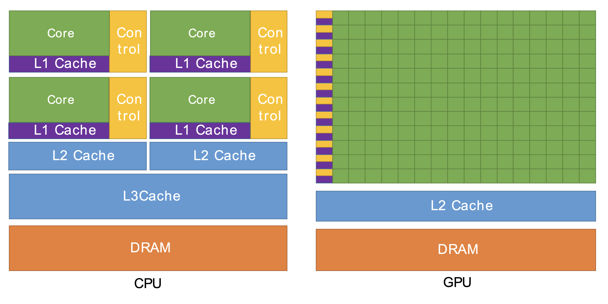
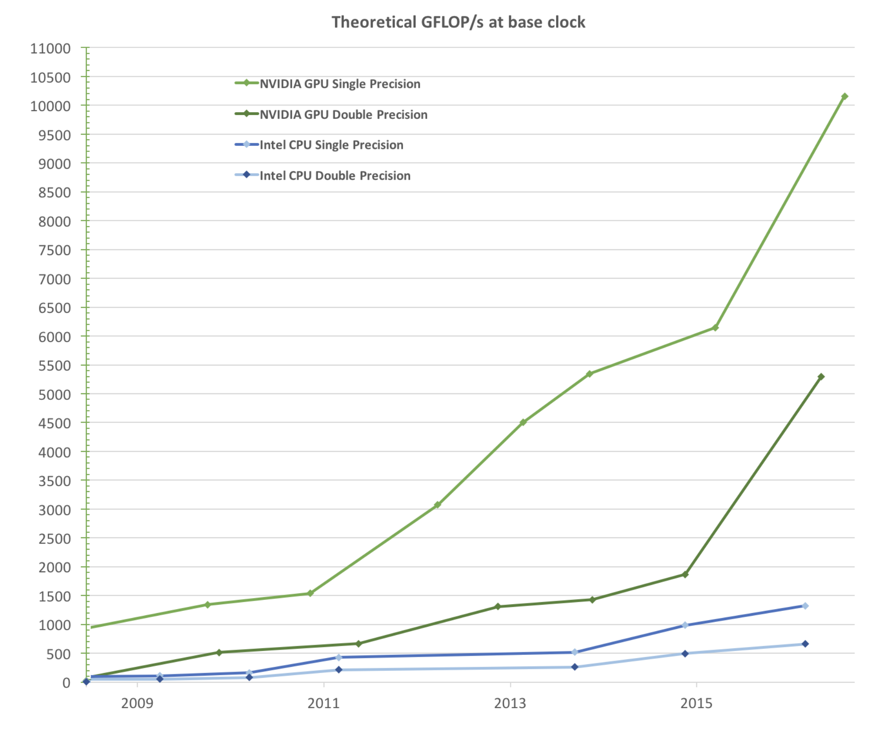
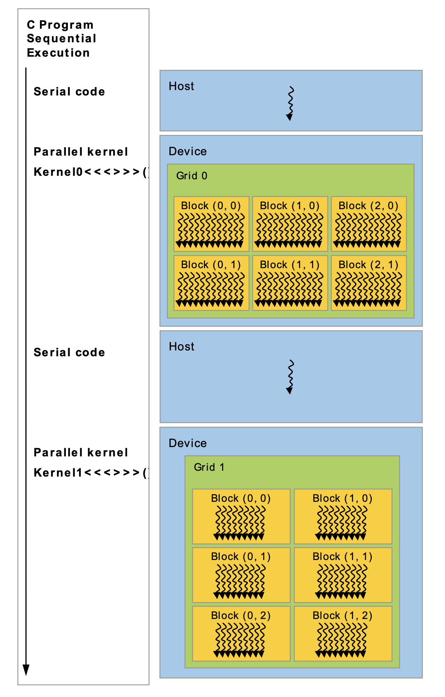
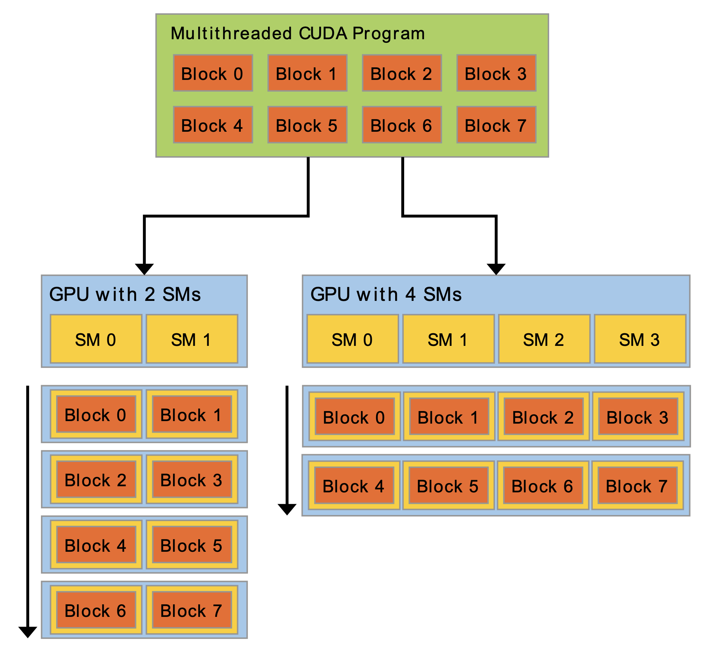
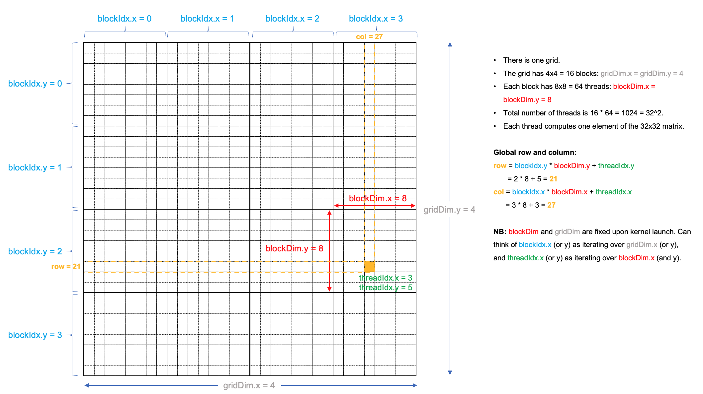

## GPU Compute
### Design: GPU vs CPU
- GPUs were originally designed to render graphics. In contrast, CPUs are designed to control the logical flow of general purpose programs. 
- Because of these different roles, GPUs have far more processing units and higher aggregate memory **bandwidth** (a measure of the data transfer speed between a GPU and its system), whereas CPUs have more sophisticated instructions processing and and faster **clock speed** (the number of times a second that a circuit operates). 

<p align="center">
        
</p>

*Mental model of CPU and GPU. Taken from Section 1.1 of the [CUDA C++ Programming Guide (v.11.2)](https://docs.nvidia.com/cuda/archive/11.2.0/pdf/CUDA_C_Programming_Guide.pdf).*

- The transistor counts associated with various functions are represented abstractly by the relative sizes of the different shaded areas. 
    - Green represents computation,
    - Yellow represents instructions processing,
    - Purple represents L1 cache,
    - Blue represents higher-level cache,
    - Orange represents memory, which should be ~1000x larger than the caches.
- NOTE: the diagram does not depict the actual hardware design of any particular CPU or GPU. But, the figure does suggest that:
    - CPUs can handle more complex workflows than GPUs. 
    - CPUs don't have as many arithmetic logic units (LGUs) or floating point units (FPUs) as GPUs (roughly the small green boxes), but the ALUs and FPUs in a CPU core are individually more capable.
    - CPUs have more cache memory than GPUs.

- Crucially, GPUs are designed for workloads that can be **parallelized** to a significant extent. This is indicated in the diagram by the GPU having just one yellow control box for every row of the small green computational boxes. 

### Performance: GPU vs CPU
- The figure below show the peak speed (measured in billions of floating point operations per second, also known as **GFLOPS**). 

<p align="center">
        
</p>

*Floating-point operations per second (FLOPS) for the CPU and GPU. Taken from Section 1.1 of the [CUDA C Programming Guide (v.9.1)](https://docs.nvidia.com/cuda/archive/9.1/pdf/CUDA_C_Programming_Guide.pdf).*

- Note that single precision floats can often be processed 2x faster than their double precision counterparts. 
    - **Single precision** refers to a 32-bit representation of floating point numbers (also called FP32).
    - **Double precision** refers to a 64-bit representation of floating point numbers (also called FP64). 

### Heterogeneous Applications and the CUDA Programming Model
- **GPGPUs** (general purpose computing on GPUs): the fact that any application requiring a huge number of floating point operations can gain significant speedup using GPUs. 
- **CUDA** (Compute Unified Device Architecture) is one of the key enabling technologies for GPGPU. 
    - Developed by NVIDIA, CUDA was one of the first APIs to accelerate numerically intensive computations such as matrix multiplications, fast Fourier transforms (FFTs), and more.
- The following lists some fields that have successfully used CUDA and NVIDIA GPUs to accelerate performance:
    - Deep Learning,
    - Computational Fluid Dynamics,
    - Molecular Dynamics,
    - Quantum Chemistry,
    - Computational Physics.

- GPUs are hosted on CPU-based systems. Given a heterogeneous computer with both CPUs and GPUs, it is often a good strategy to offload massively parallel and numerically intensive tasks to the GPU(s). 
- Most HPC applications contain both highly parallel and less-parallel parts, so it adopting the heterogeneous programming model is often the best way to utilise the strengths of both GPUs and CPUs. 

<p align="center">
        
</p>

*Heterogeneous programming with CUDA. Taken from Section 1.4 of the [CUDA C++ Programming Guide (v.11.2)](https://docs.nvidia.com/cuda/archive/11.2.0/pdf/CUDA_C_Programming_Guide.pdf).*

- In fact, the so-called "CUDA programming model" is a heterogeneous model where both the CPU and GPU are used. 
- In CUDA, the *host* refers to the CPU and its memory, while the *device* refers to the GPU and its memory. 
- Code run on the host can:
    - Manage memory on both the host and device,
    - Launch *kernels* (more below) which are functions executed in parallel on the device. 
- Given the above, a typical sequence operations for a CUDA C/C++ program is:
    1. Declare and allocate host and device memory.
    2. Initialize host data.
    3. Transfer data from the host to the device.
    4. Execute one or more kernels.
    5. Transfer results from the device to the host.
    
    For a complete example of this, see [SAXPY kernel](../src/saxpy.cu). 
- GPUs can outperform CPU-based processors by a lot, provided that the application is written to take full advantage of the GPU hardware's parallelism.  

### Threads and Cores: GPU vs CPU
- As discussed, GPUs are powerful parallel computation engines. 
- But CPUs too have evolved into highly capable parallel processors in their own right. With this, they have acquired certain similarities with GPUs. As a result, there is overlap in the terminology used to describe parallelism in both types of processors. To avoid confusion, we must understand the distinctions well, because the precise meanings of these terms sometimes differ significantly. 
- For example, on both CPUs and GPUs, one may speak of **threads** that run on different **cores**. In both cases, this refers to distinct **streams of instructions** that are scheduled to run on different **execution units**. However, the ways in which thread and cores act on data are different. 
    - A single core in a GPU - which we call a **CUDA core** - is more like a vector lane in the vector processing unit of a CPU. This is because CUDA cores are working in teams of 32 to execute **Single Instruction on Multiple Data (SIMD)** which is a type of parallelism. 

The table below lists and defines the terms related to the different levels of parallelism in a GPU and gives their rough equivalents in CPU terminology. 

| GPU term                      | Quick definition for a GPU                                                                                                                                 | CPU equivalent |
|-------------------------------|-------------------------------------------------------------------------------------------------------------------------------------------------------------|----------------|
| **Thread**                        | The stream of instructions and data that is assigned to one CUDA core; note, a Single Instruction applies to Multiple Threads, acting on multiple data (SIMT) | N/A            |
| **CUDA core**                     | Unit that processes one data item after another, to execute its portion of a SIMT instruction stream                                                       | vector lane    |
| Warp                          | Group of 32 threads that executes the same stream of instructions together, on different data                                                               | vector         |
| Kernel                        | Function that runs on the device; a kernel may be subdivided into thread blocks                                                                             | **thread(s)**      |
| SM (streaming multiprocessor) | Unit capable of executing a thread block of a kernel; multiple SMs may work together on a kernel                                                            | **core**           |

### SIMT and Warps
- **Single Instruction Multiple Threads (SIMT)** is closely related to the better known term **Single Instruction Multiple Data (SIMD)**. 
    - In SIMD, a single instruction acts on *all the data* in *exactly* the same way. 
    - In SIMT, this restriction is relaxed slightly: selected threads can be activated/deactivated, meaning that instructions and data are processed only on the active threads, while local data remain unchanged on inactive threads. 
    - As a result, SIMT can perform **branching** (though not very efficiently): given an *if-else* starting with `if (condition)`, the threads for which `condition==true` will be active when running statements in the `if` clause, and equivalently for the threads for which `condition==false`. The result will be correct, but inactive threads will do no useful work while waiting for statements in the active clause to complete (see figure). This phenomenon of **warp divergence** will be explained further below.  

<p align="center">
        
</p>

- Note that SIMT also exists on CPUs, for example x86_64 has *masked variants* in which a vector instruction can be turned on/off for selected vector lanes according to the true/false values in an extra vector operand.

- **Warp**: at runtime, a thread block is divided into **warps** for **SIMT** execution. 
    - A warp consists of 32 threads with consecutive thread indexes (e.g. `0, 1, ..., 31` or `32, 33, ..., 63`). 
    - The 32 threads in a warp are processed together by a set of 32 CUDA cores. This is analogous to the way that a vectorized loop on a CPU is chunked into vectors of a fixed size, then processed by a set of vector lanes.
    - **But why exactly 32?** Because in NVIDIA's hardware, the CUDA cores are divided into fixed groups of 32. Breaking down a large block of threads into chunks of this size simplifies the SM's task of scheduling the entire thread block on its available resources.
    - Arguably, the existence of warps is a hardware detail not directly relevant to the programmer. However, the warp-based execution model has implications for performance that can influence code design (see the [sum reduction kernels](./sum_reduction.md) for an example). As the figure above illustrates, branching can slow down the execution of a warp, if two (or more) threads in the same warp branch into different instructions. 
- **Warp divergence**: occurs in CUDA when threads within the same warp follow different execution paths due to conditional branches such as if-else statements (as allowed by SIMT).
        - In CUDA, threads within the same warp execute in lockstep (same instruction at the same time). Thus, when warp divergence happens, the warp must **serialize the execution of each branch path**. In other words, the warp must process each unique path in sequence rather than in parallel. 
        - This serialization leads to underutilization of the GPU's computing resources because while some threads are active, others are idle and must wait (see figure above). 
        - Thus, warp divergence can significantly affect performance.
        - For this reason, a programmer should avoid branching within warp-sized sets of loop iterations.
        - Check out the [sum reduction kernels](./sum_reduction.md) to see the effect of warp divergence and how to prevent it. 


## Kernels and SMs
- **Kernel** (*software* concept): a function meant to be executed in parallel on an attached GPU. 
    - In CUDA C/C++, a kernel is identified by the `__global__` specifier in front of an otherwise normal-looking C++ function declaration.
    - The designation `__global__` indicates that the function will run on the device, but may be called from either the host or the device.
    - A kernel is executed `N` times in parallel by `N` different threads on the GPU. Each thread is assigned a unique ID (i.e. an index) that it may use to compute memory addresses and make control decisions. 
    - Thus, kernel calls must provide special arguments saying how many threads to use on the GPU. This is done via the **execution configuration**, which looks like `fun<<< NUMBER_OF_BLOCKS, NUMBER_OF_THREADS_PER_BLOCK>>>`. The first entry specifies the number of **thread blocks** to use. The second entry is the number of threads in a thread block. 
    - Unlike much C/C++ code, launching kernels is **asynchronous**: the CPU code will continue to execute without waiting for the kernel launch to complete. A call to `cudaDeviceSynchronize, a function provided by the CUDA runtime, will cause the host (CPU) code to wait until the device (GPU) code completes, and only then resume execution on the CPU.
    -  The **order of execution of threads is undefined**. 
- **Streaming multiprocessors** (SMs) are the *hardware* homes of the CUDA cores that execute the threads.
    - The number of SMs that the GPU will actually use to execute a kernel call is limited to the number of of blocks specified in the call (execution configuration). 
    - For example, for `fun<<<M, N>>>(x, y, z)`, there are *at most* `M` blocks that will be assigned to different SMs. 
    - A block may not be split across different SMs. 
    - If there are more blocks than available SMs, then at least one SM will get more than one block. 
    - By distributing blocks this way, the GPU can run independent blocks in parallel on different SMs. 
    - Each SM then divides the `N` threads in its current block into **warps** of 32 threads for *internal* parallel execution. 
    - Each SM has several levels of memory that can only be accessed by the CUDA cores of that SM: registers, L1 cache, constant caches, and shared memory. 

<p align="center">
        
</p>

*Scalability: a multithreaded program is partitioned into blocks of
threads that execute independently from each other, thus a GPU with more SMs will automatically execute the program in less time than a GPU with fewer SMs. Taken from Section 1.3 of [CUDA C++ Programming Guide (v.11.2)](https://docs.nvidia.com/cuda/archive/11.2.0/pdf/CUDA_C_Programming_Guide.pdf).* 

## Dimensions, Mapping, and Indexing
- Recall that the host invokes a kernel using the *execution configuration* specified inside the triple chevron `<<< >>> `. 
- **Dimensions**: 
    - Because many parallel applications involve multidimensional data, it is *convenient* to organise
        - Blocks into 1D, 2D, or 3D arrays of threads.
        - The grid into 1D, 2D, or 3D arrays of blocks.  
    - `dim3` is a vector type with three integers `x`, `y`, and `z`. 
    ```cpp
   dim3 threads(256);           // x=256, y=z=1
   dim3 blocks(100, 100);       // x=y=100, z=1
   dim3 another(64, 32, 16);    // x=64, y=32, z=16
    ```
    - Note that there is an upper bound on the number of threads per block, imposed by the limited number of registers that can be allocated across the threads in a block. You can find this limit by running the [device query program](../src/device_info.cu).
- **Mapping**: every thread has a unique set of indices to distinguish them from other threads. 
    - These indices are usually used to access the correct memory locations and *may* be used for making control decisions (recall branching).
    - Each of the below are `dim3` structures.

        | Name      | Description                          | x           | y           | z           |
        |-----------|--------------------------------------|-------------|-------------|-------------|
        | `threadIdx` | Thread index within a block (zero-based) | `threadIdx.x` | `threadIdx.y` | `threadIdx.z` |
        | `blockIdx`  | Block index within the grid (zero-based) | `blockIdx.x`  | `blockIdx.y`  | `blockIdx.z`  |
        | `blockDim`  | Block dimensions (in number of threads) | `blockDim.x`  | `blockDim.y`  | `blockDim.z`  |
        | `gridDim`   | Grid dimensions (in number of blocks) | `gridDim.x`   | `gridDim.y`   | `gridDim.z`   |

- **Indexing**: the figure below demonstrates how a thread is identified by a unique combination of indices. 

