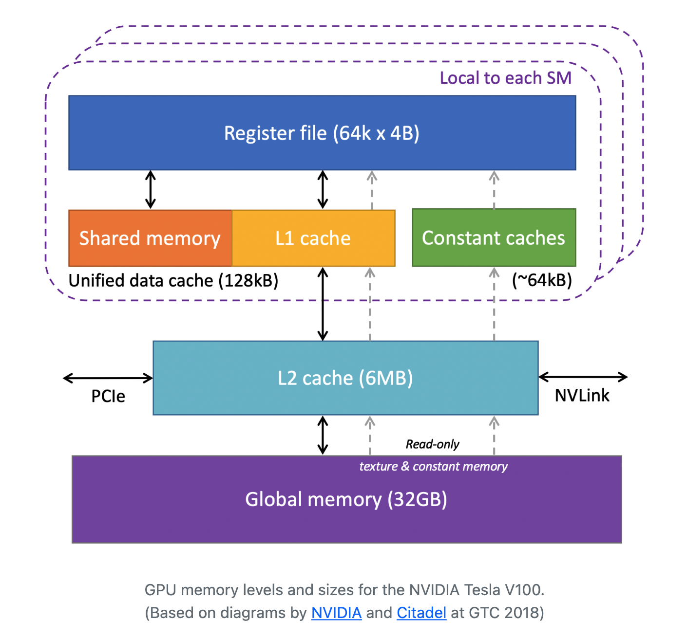

# GPU Memory
## Memory levels
- An SM has far more **registers** than a CPU core. 
    - **Registers** are small and fast storage locations within a processor core (CUDA core or CPU core) that hold data to be processed or intermediate results. 
    - It is much faster to access data from a register than from cache or memory. 
    - For example, the Tesla V100 has 65,536 registers in its **register file** (a collection of all registers in the SM). Note: a register file is not a file in the usual sense of a document stored on a disk or in memory. Rather, it is a hardware component (within a processor) that consists of a set of "registers." These registers are tiny, extremely fast memory locations directly within the processor itself. 
    - The multitude of registers allows handling of many threads in parallel, since each thread can have some registers allocated to it. 
    - Each register in the SM is designed to hold a single data element (e.g. a single float, which is 4 bytes), unlike a CPU core's vector register which can hold multiple data elements (e.g. 16 floats in AVX-512). This difference is because GPUs are designed for parallel processing of many lightweight threads, each working on a single piece of data.
    - Despite each register in an SM holding less data than a CPU core's vector register, the total capacity of the SM's register file is larger due to the large number of registers. 
- However, CPUs have larger total cache size: every Intel CPU core comes with L1 and L2 data caches and the size of these plus its share of the shared L3 cache is much larger than the equivalent caches in a GPU, which has nothing beyond a shared L2 cache. The figure below shows the memory hierarchy of the Tesla V100. 

<p align="center">
        
</p>

- Depending on where the data starts, it may have to step through multiple layers of cache to enter the registers of an SM and thus become accessible to the CUDA cores. 
- **Global memory** is (by far) the largest layer, but it is the furthest from the SMs. 
- Remarks
    - L2 cache mediates data transfers onto and off the device. 

## Memory Types
- **Memory areas of every SM** (on-chip and closest to the CUDA cores):
    - **Register File**: the area of memory that feeds directly into the CUDA cores. It is organised into 32 *banks*, matching the 32 threads in a **warp**. The register file can be thought of as a big matrix of 4-byte elements, having 32 columns and *many* rows. A warp operates on full rows: within a row, each thread (CUDA core) operates on a different column (*bank*). 
    - **L1 Cache**: the usual on-chip storage location providing fast access to data that are recently read from, or written to, main memory (RAM). L1 also serves as the overflow region for **register spilling**, which is when the amount of active data exceeds what an SM's register file can hold. 
    - **Shared Memory**: the area of memory that physically resides in the same memory as the L1 cache, but differs in that all of its data may be accessed by *any thread in a given thread block*. This allows threads within a block to communicate and share data with eahc other. Note: variables that occupy shared memory must be declared explicitly by the application in question. 
    - **Constant Caches**: special caches for variables declared as **read-only** constants in global memory (see below). These can be read by any thread in a given thread block. The main (and best) use of constant caches is to **broadcast** a single constant value to all threads in a warp. 
- **Memory areas *shared* by all the SMs** (further away and larger):
    - **L2 Cache**: on-chip cache for keeping copies of the data that travels back and forth between the SMs and main memory. Like L1, L2 is intended to speed up subsequent reloads. Unlike L1, there is just one L2 shared by all SMs. 
    - **Global Memory**: the bulk of the *main* memory of the *device* (GPU), equivalent to RAM in a CPU. For example, Tesla V100 has special HBM2 (high bandwidth memory) while the Quadro RTX 5000 has fast GDDR6 graphics memory. 
    - **Local Memory**: specially mapped regions of main memory that are assigned to each SM. On a particular SM, when register spilling overflows L1, excess data is further offloaded to L2, then to "local memory". The performance penalty for reloading a spilled register increases with every memory level that must be traversed to retrieve it.  
    - **Texture and Constant Memory**: regions of main memory treated as read-only by the device. 

## HBM and GDDR
- **GDDR**  (Graphics Double Data Rate): the ability of the memory to perform 2 data transfers per clock cycle, which is why the calculation of the peak bandwidth must include an extra factor of 2. 
- **HBM (High Bandwidth Memory)**: offers higher bandwidth while using less power than traditional GDDR memory, achieved through a wide interface and stacking multiple DRAM dies. 

## Host-to-device and device-to-device transfers
- Host-to-device transfers are CPU-to-GPU. Device-to-device transfers are GPU-to-GPU. The interconnection is done via NVLink or PCIe: 
    -  **NVLink**: a multi-GPU connector that enables high-speed point-to-point interconnectivity between GPUs (and also between GPUs and CPUs).
    - **PCIe** (Peripheral Component Interconnect Express):  high-speed interface standard used to connect various hardware components in a computer system.
- The speed at which data can be transferred from the host to the device and back is set by the type of interconnect. In most cases, GPU devices are inserted into expansion slots in their hosts, and the number of PCIe lanes in the slot determines the peak bandwidth. For example, the Tesla V100 is commonly connected to the host by 16 lanes (x16) of PCIe3, each capable of 1 GB/s in each direction, providing an overall bidirectional bandwidth of 32 GB/s. 
- Crucially, the high flop rate of a GPU is only meaningful if the data rate from and to the host can keep up. 

## Memory: clock rate, bus width, and peak bandwidth
- **Memory Clock Rate**: the rate at which the GPU can read from (or write to) its memory (GDDR or HBM).
    - Measured in **GHz** i.e. Gigacycles/s. 
- **Memory Bus Width**: the size of the interface through which data is transferred between the GPU's processor and its memory. 
    - Measured in **bits/cycle**. 
    - For example, a 256-bit memory bus can transfer 256 bits of data simultaneously in one cycle. 
    - A wider bus allows more data to be transferred at once, increasing the data throughput. 
- **Peak Memory Bandwidth**: the maximum amount of data that can be transferred to (and from) the GPU's memory, per unit of time. 
    - Measured in **GB/s**. 
    - Crucially, the data transfer described above is between the CUDA cores and the GPU's dedicated memory (such as HBM or GDDR). 
    - Can be calculated from the **bus width** and **clock rate**. 
    - `Clock Rate (in GHz) * Bus Width (in bits) / 8 = Bandwidth (in GB/s)`. If GDDR memory, you must multiply by an extra factor of 2. 
- As a simple analogy, imagine you are transferring water from one container to another container using a bowl.
    - The clock rate is akin to how quickly you can perform each scoop. More precisely, it tells you how many scoops of water you can transfer per second.
    - The bus width is akin to the size of the bowl, i.e. how much water you can transfer with each scoop. If the bowl was 2x bigger, you would transfer the water 2x faster, assuming the duration of a scoop remains unchanged.
    - The peak memory bandwidth combines the two: if you can perform more scoops per second (higher clock rate) and each scoop is larger (wider bus), you will transfer the water faster. 

We can use `device_info.cu` to get the clock rate, bus width and peak bandwidth of your GPU(s):
```bash
nvcc src/device_info.cu -o device_info -run
```
For example, on a Tesla T4, this returns
```
CUDA Device #0
  Device name:                   Tesla T4
  Major revision number:         7
  Minor revision number:         5
  Total global memory:           14.58 GB
  Total shared memory per block: 48 KB
  Total registers per block:     65536
  Warp size (threads):           32
  Maximum memory pitch:          2048 MB
  Maximum threads per block:     1024
  Maximum dimension 0 of block:  1024
  Maximum dimension 1 of block:  1024
  Maximum dimension 2 of block:  64
  Maximum dimension 0 of grid:   2147483647
  Maximum dimension 1 of grid:   65535
  Maximum dimension 2 of grid:   65535
  Core clock rate:               1590.00 MHz
  Total constant memory:         64 KB
  Texture alignment:             512 bytes
  Concurrent copy and execution: Yes
  Kernel execution timeout:      No
  Memory clock rate:             5.0010 GHz
  Memory bus width:              256 bits
  Peak Memory Bandwidth:         320.0640 GB/s
  Number of SMs:                 40
  Number of CUDA cores:          2560
```
The peak memory bandwidth is computed from the memory clock rate and memory bus width: `2 * (5.001 Gcycles/s) * (256 bits/cycle) / (8 bits/byte) = 320.064 GB/s`. The division by `8` follows from the assumption of single precision (FP32). The extra factor of `2` is due to the fact that the Tesla T4 has GDDR memory, which means there are 2 data transfers per cycle. In our analogy, this is akin to having two bowls and using a bowl in each hand.