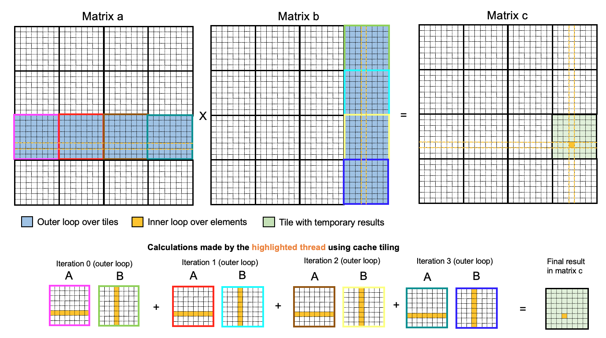

## Cache Tiled Matrix Multiplication

### Cache tiling
- **Cache tiling** is an **optimization** technique that can be used to speed up matrix multiplication. 
- Regular DRAM is slow, so it would be nice if we could guarantee that data is in the cache when needed. 
- This would mean fewer memory related stalls and more computation per unit time. 
- On CUDA-enabled GPUs, a solution is to use **shared memory**: this is **user-managed L1 cache** that is **private per thread block**. 
    - It is user-managed in the sense that the programmer must declare when variables are stored in shared memory. 

### Cache tiled matrix multiplication
- Suppose that the matrix `c` is the result of multiplying matrices `a` and `b`. 
    - Recall that `c_ij = a_ik * b_kj` (assuming Einstein summation convention).
    - In other words, the element of `c` at row `i` and column `j` is given by the dot product of the `i`th row of `a` and the `j`th row of `b`. 
- To apply cache tiling to matrix multiplication, split the resulting matrix `c` into submatrices. 
    - One thread block will be responsible for every submatrix.
    - In particular, each thread in the block will calculate for **exactly** one element of the submatrix, one dot product at a time. 
- The implementation of cache tiled matrix multiplication requires two loops:
    - Outer loop over tiles.
    - Inner loop over elements *within* the tiles in question. 

#### Outer loop
- A tile is a *submatrix* (usually 16x16) that can be loaded from global memory to shared memory (i.e. user managed L1 cache) to enable faster memory access. 
- The **outer loop** iterates over **tiles**:
    - Horizontally (left-to-right) for `a` (the first matrix).
    - Vertically (up-to-down) for `b` (the second matrix). 
- In each iteration of the outer loop:
    - One tile from `a` is loaded into `A` (shared memory), and
    - One tile from `b` is loaded into `B` (shared memory). 
    - Crucially, *each thread* loads **exactly**
        - One element in `a`'s current tile into `A`,
        - One element in `b`'s current tile into `B`. 

        This also explains why `__syncthreads()` is needed after loading from the relevant tiles (in `a` and `b`) into shared memory (in `A` and `B`): we must guarantee that every thread within the thread block in question has loaded its values into shared memory, since the threads will *use values loaded by other threads*. 
    - Each thread computes a *partial result* for its corresponding element in the `c` submatrix. The thread repeats the above in each subsequent iteration. 
- Once the outer loop has completed, every element of the `c` submatrix will have been calculated. 

#### Inner loop
- The **inner loop** iterates over **elements**:
    - Horizontally (left-to-right) *within* the relevant row of `A` (the current tile of `a`). 
    - Vertically (up-to-down) *within* the relevant column of `B` (the current tile of `b`).

    Note that the "relevant" row and column is given by the thread in question. 

- In each iteration of the inner loop:
    - One element of `a` (more precisely `A`) is multiplied by one element of `b` (more precisely `B`). 
- Overall, one iteration of the *outer* loop (encompassing the complete inner loop) computes the dot product of a row in `A` and a column in `B`. This is added to a temporary accumulator. Once the outer loop has finished, the accumulator equals the final result. 

#### Example
- Let us walk through a concrete example: see Figure 1 below. 
    - Consider the submatrix of `c` shaded in light green.
    - Pay special attention to the element shaded in orange. As with any other element, this is computed by a single thread. 
- Consider the four iterations of the outer loop:
    - Iteration 0: 
        - The **pink** submatrix in `a` is loaded into `A`. 
        - The **green** submatrix in `b` is loaded into `B`. 
        - For the thread in question (e.g. the orange one we focus on), the dot product is computed (using the inner loop over elements) between the relevant row in `A` and the relevant column in `B`. The result is stored in a temporary accumulator variable (say) `tmp`.
    - Iteration 1: 
        - The **red** submatrix in `a` is loaded into `A`. 
        - The **turqoise** submatrix in `b` is loaded into `B`. 
        - For the thread in question, compute the dot product between the relevant row in `A` and the relevant column in `B`. This is *added* to `tmp`.
    - Iteration 2: 
        - The **brown** submatrix in `a` is loaded into `A`. 
        - The **yellow** submatrix in `b` is loaded into `B`. 
        - For the thread in question, compute the dot product between the relevant row in `A` and the relevant column in `B`. This is *added* to `tmp`.
    - Iteration 3: 
        - The **teal** submatrix in `a` is loaded into `A`. 
        - The **blue** submatrix in `b` is loaded into `B`. 
        - For the thread in question, compute the dot product between the relevant row in `A` and the relevant column in `B`. This is *added* to `tmp`.

        

*Figure 1. Cache tiled matrix multiplication.*

### Naive vs. cache tiled matrix multiplication
- `nvprof` can be used to compare the speed difference between the naive and cache tiled implementation of matrix multiplication. To do this, simply run `make matmul_compare` from the root of the repo. 
- For example, on an NVIDIA Tesla T4 GPU, 